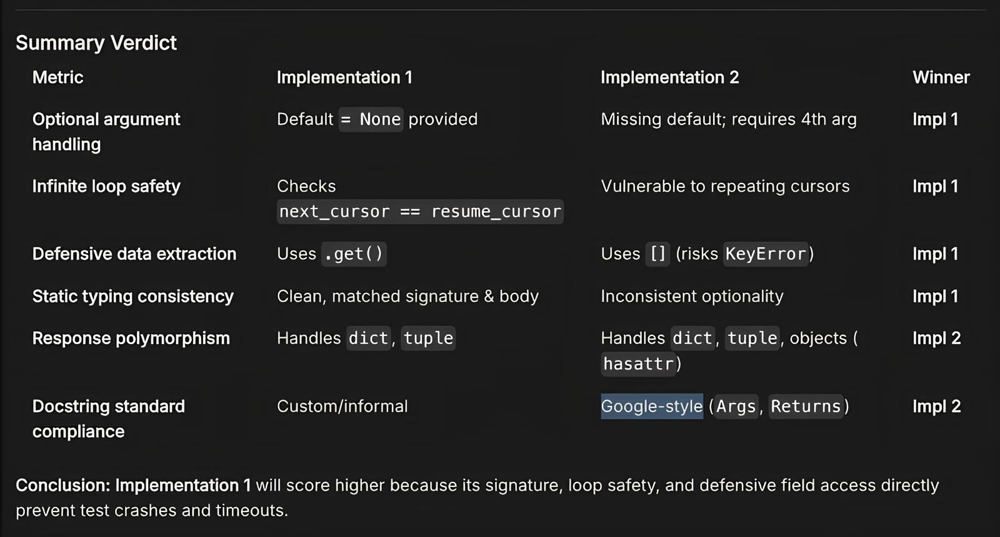

# stateful-iteration-invariants



A skill for coding agents: a unified discipline for stateful loops and deep
exploration. Before writing any `while`, `for`, stop/skip/continue, or
recurse statement, it forces agents to name isolated invariant sets, state the
stop rule in words, hand-trace iteration 1 against seeded state, and verify
direction, ordering, depth-bounding, and falsy-safety.

Covers two dialects: **linear streams** (paging, sync cursors, backfills,
retries — `written` / `frontier` / `resume_cursor`) and **branching
hierarchies** (trees, ASTs, graphs — `seen_ids` / `worklist` /
`breath_limit` / `pause_trail` / `finding`).

1 initial revision was made, based on benchmarking (see [`benchmarks/REPORT_p1.md`](benchmarks/REPORT_p1.md)).

The skill itself is [`SKILL.md`](SKILL.md) — drop-in for any
SKILL.md-compatible agent.

## Install

Claude Code — copy into your skills directory:

```bash
mkdir -p ~/.claude/skills/stateful-iteration-invariants
cp SKILL.md ~/.claude/skills/stateful-iteration-invariants/SKILL.md
```

Muse Code — import from your Claude skills:

```bash
muse skills import --from claude
```

## Does it help? Blind-judged benchmark

Tested on `muse-spark-1.3`, which scores high on instruction-following.
Five realistic tickets (paginated ingestion, TTL cache, watermark
catch-up, tree flattener, crash-resumable sync), solved with and without the
skill by `muse-spark-1.3` at high effort, then scored by a second model
session that is blind to everything: same fixed rubric every test
(correctness > robustness > clarity, must name a concrete divergent input,
verdict `A`/`B`/`TIE`), labels shuffled per test. Full reports with diffs,
fixtures, and judge transcripts live in [`benchmarks/`](benchmarks/)
(`REPORT_p1`/`p2`/`p3`/`p4`/`p5`).

| Task | Blind judge |
|---|---|
| p1 paginator + redelivery | **skill** (exact-type catch, `None`-safe identity) |
| p2 cache + LRU + stampede | **skill** (no re-entry deadlock, no hung followers on clock failure) |
| p3 resume-sync | **skill** |
| p4 watermark catch-up | **skill** (dedup-before-watermark; base exits early on redelivered offsets) |
| p5 tree flattener | **skill** (symlink-alias semantics + type guards) |

Score: skill 5, base 0.

## Why? How?

In search of benchmarks for SKILL.md's, you find the measurable effect of the master-set at [`skillsbench.ai/leaderboard`](https://skillsbench.ai/leaderboard/) echoed by the recent boost in common models 🙏🙏.

It began with a beautiful piece of code that took a while to make prose as a mould:

To search inside something, it must be a root system with branches you can traverse, not empty or flat. A descent cannot go on forever; at a depth where you need to breathe, you pause.
To find something deep inside a root system, you set out with a real way of knowing when you've found what you seek, and an optional choice to be unsafe. Without a root system to search, you report having found nothing.
Setting out, you keep track of what you find: you know what you are looking for; you do not stop until you are done; you start with nothing found; and you remember what you have seen. Unless choosing to be unsafe, you mark the root node as seen so you do not search inside it again. You leave room to record where you pause. You start with one place to search: the whole root system from its beginning.
As long as you have places left to search and have not yet found what you seek, take the next place waiting. Leaving your trail clear to record any new pause, walk through it, beginning a fresh descent. If depth forced you to pause, remember those steps so you are ready to resume from the deepest point first. When no places remain or you have found what you seek, report what you found.
When you find what you seek, you can describe it in its context, rather than simply reporting the element in its original form. Even when that description is empty, false, or nothing, it becomes what you found.
To walk through an element from where you left off at a given depth:

- If it is an ordered list, walk to the end: at each position, if you find what you seek, report it; if you had to pause, remember the next position so you can resume there, and step back out for air.
- If it is an unordered list, count through each named branch until you reach where you left off: at each position, if you find what you seek, report it; if you had to pause, remember the next position so you can resume there, and step back out for air.

To find what you seek at any position along the descent, look at what sits there.
If it is what you seek, report it: if you chose to describe what you found, report that description; otherwise report the element in its original form.
If it is not what you seek, and the element has no branches or you have already seen it, move on.
Otherwise, unless you chose to be unsafe, mark it as seen so you do not search inside it again.
If you still have breath to go deeper, walk inside this element from its beginning, one step deeper. But at a depth where you need to breathe, go no further: remember this element from its beginning as where you paused, to resume later.
If you have something to report or had to pause, step back out to the surface.
